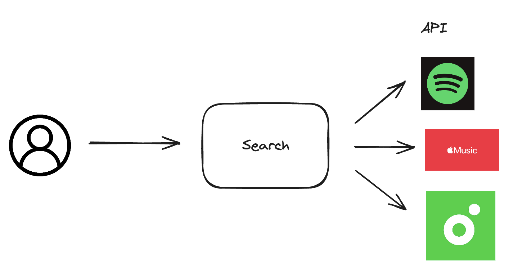

뮤즈는 음악 취향 공유 플랫폼이다.
유저들이 음악 취향을 공유하는 방법에는 노래를 검색하여 리아크하거나, 친구에게 공유하거나, 저장하는 방법이 있다.
서버에서 노래 검색 결과를 잘 반환해주어야한다.
전체 음악 정보를 이미 가지고 있다면 좋겠지만, '웹 상에 등록되어있는 모든 노래'를 전부 수집하는 건 어렵다.
왜냐하면, 음악 플랫폼 API를 사용해서 노래 정보를 수집해야하는데,

1. API 검색을 위한 키워드(노래 제목, 아티스트)를 전부 수집하기 어렵다.
2. API rate limit가 설정되어 있기 때문에, 수집 시간이 오래 걸린다.


키워드 수집에 대한 어려움은 두 가지 방법으로 해결이 가능하다.
```1-a1. 전부 수집하기보다는 범위를 제약해서 수집한다.```
예를 들어, 모든 나라에 대한 노래 리스트를 만들기보다는, 우선 한국에 있는 노래 리스트로 제약하는 것이다.
하지만, 범위를 제약한만큼, 사용자가 늘어나 사용자가 찾는 노래가 수집 범위를 벗어나는 경우가 발생하면, 그때마다 수집 범위를 늘려 다시 수집해야하는 문제가 발생할 수 있다. 한국에 있는 노래가 아니여도, 유명한 다른 나라 노래라면 검색이 가능해야 서비스에 불편함이 없을 것이다. 인기 차트를 크롤링해오는 방식을 고려해볼 수도 있다. 하지만, 어쩔 수 없이 검색 범위를 벗어나는 경우가 발생할 수 밖에 없고, 서비스 이용 경험을 해칠 수 밖에 없다.

그래서 생각한 방법은 음악 API를 검색에 바로 활용하여 검색 결과를 최대한 잘 반환할 수 있도록 구성하는 것이다.(검색 결과 범위는 적어도 음악 API 결과만큼은 나오게 된다.) 이렇게 되면 검색 결과의 범위에 대한 문제는 해결된다. 만약 하나의 음악 플랫폼 API와 연동한다면, 결과가 다른 단독 플랫폼보다 더 잘 나올 수 있다.
그리고, 검색 결과를 백그라운드로 저장해서 데이터를 확보하는 식으로 구성하면, 점진적으로 보유중인 데이터의 범위를 늘려 나갈 수 있다.

그 대신, 이 검색 기능이 API가 만약 실패할 경우에도 동작할 수 있게, 그리고 최대한 빠르게 결과를 리턴할 수 있도록 구성해야할 것 같다. 그리고, API마다 있는 rate limit에 걸리지 않도록, 여러 개의 API를 연동해서 번갈아가면서 사용할 수 있도록 구성을 해야할 것 같다.



세 가지 API를 사용해서 음악 검색을 구성한다. 단일 API에 대한 의존성을 최소화하기 위함이다.
각 API들은 Rate Limit을 가지고 있기 때문에, 이 Rate Limit에 걸리지 않도록, API호출 전에 Token Bucket을 사용해서 호출 간격을 조절한다.

우선 각 API의 Rate Limit을 파악한다.
- Spotify: 실험결과 30초당 300-400회 정도 호출이 가능하다. 즉 1초당 10회정도

- Shazam: 
X-RateLimit-Requests-Limit: 500
X-RateLimit-Requests-Remaining: 375
X-RateLimit-Requests-Reset: 2251166
X-RateLimit-rapid-free-plans-hard-limit-Limit: 500000
X-RateLimit-rapid-free-plans-hard-limit-Remaining: 499875
X-RateLimit-rapid-free-plans-hard-limit-Reset: 2251166


- Youtube: 일일 100,000회 무료 호출이 가능하고, 넘어갈 경우 비용이 청구된다. 비용이 내지 않는 선에서 Rate Limit을 설정해준다.

