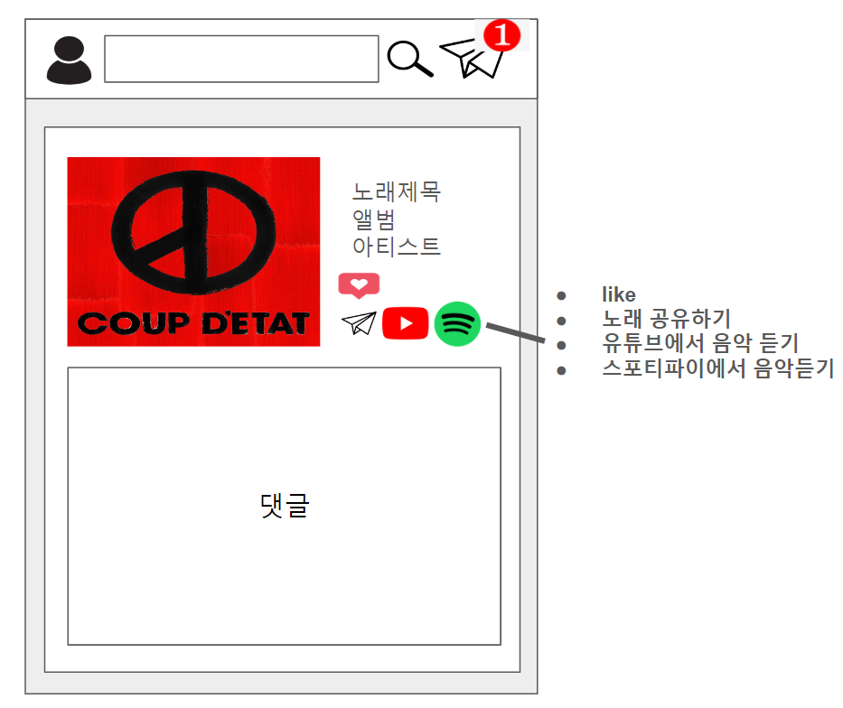
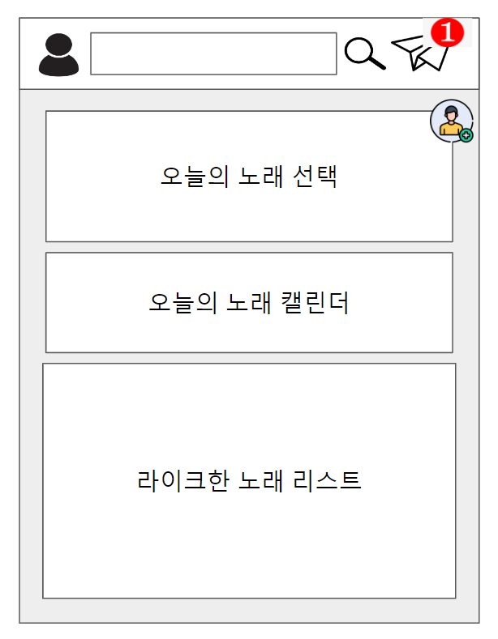

### Muze는 음악 취향을 공유하는 SNS
- 사용자는 홈화면에서 자신의 친구들의 활동 내역을 조회할 수 있다.
- 사용자는 날마다 '오늘의 노래'를 설정할 수 있다.
- 노래를 검색하고 선택하여, 1) 오늘의 노래로 설정하거나, 2)저장하거나, 3)라이크를 누르거나, 4)친구에게 공유할 수 있다.

**홈 화면**

- 뉴스 피드를 확인할 수 있습니다.
	- 피드에는 친구들의 활동(오늘의 노래 선택, 라이크, 노래 공유(비공개 가능))을 확인할 수 있습니다.
**네비게이션 바**
- 자신의 프로필 페이지 링크
- 노래 검색
- 메세지 인박스 확인
- 친구 요청 조회

**선택한 노래 화면**

- 선택한 노래의 정보 확인
- '오늘의 노래'로 선정
- 노래에 댓글 
- 노래 저장
- like 기능(ID 하나당 1번 가능)
- 노래 공유하기(친구에게 메세지 형태로 전송)
- 다른 플랫폼에서 해당 노래 듣기

**프로필 화면**

- 해당 날짜에 맘에 든 '오늘의 노래' 선택 기능
- 캘린더 기능 날짜별 '오늘의 노래' 조회
- 라이크한 노래, 저장한 노래 조회
- 친구 추가(본인이 아닐 경우)
